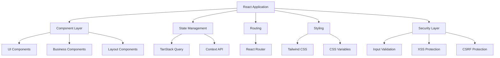
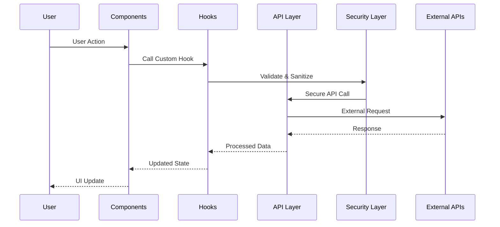

# Site Smart Chat

<div align="center">


**Plataforma de atendimento inteligente da Zapyer para unificar conversas e automações**

[🔗 Repositório](https://github.com/zapyeradmin/site_smartchat) • [🌐 App](https://smartchat.zapyer.com.br) • [🛠️ API](https://apismartchat.zapyer.com.br)

</div>

---

## Sumário

- [Visão Geral](#visão-geral)
- [Principais Recursos](#principais-recursos)
- [Arquitetura](#arquitetura)
- [Variáveis de Ambiente](#variáveis-de-ambiente)
- [Endpoints da API](#endpoints-da-api)
- [WhatsApp nos Planos](#whatsapp-nos-planos)
- [Setup e Desenvolvimento](#setup-e-desenvolvimento)
- [Deploy na Hostinger](#deploy-na-hostinger)
- [Admin](#admin)
- [Solução de Problemas](#solução-de-problemas)
- [Checklist Pós-Deploy](#checklist-pós-deploy)
- [Segurança](#segurança)
- [Licença](#licença)

---

## Visão Geral

O Site Smart Chat apresenta a plataforma de atendimento inteligente da Zapyer, focada em integrar WhatsApp e automações com Flowbuilder. Possui formulário CTA que registra prospects na tabela `clients` (Supabase) com `status = prospect`, e botões de planos com mensagens prontas via WhatsApp.

### 🎯 Propósito

Unificar atendimento via WhatsApp e web com automações inteligentes (IA + Flowbuilder), captando leads com CTA e integrando-os ao CRM (Supabase) para relacionamento, vendas e suporte.

### 👥 Público-alvo

- **PMEs e equipes de vendas** que atendem pelo WhatsApp
- **Suporte ao cliente** que precisa centralizar conversas e automações
- **Agências e parceiros** que desejam oferecer atendimento com IA
- **Times internos** buscando produtividade e organização no fluxo de atendimento

---

## Principais Recursos

### Integrações e automação

- Mensagens WhatsApp parametrizadas por plano (`src/constants/index.ts:260-268`).
- CTA com fallback de chamada para API (`src/components/cta/MultiStepCTA.tsx:109-132`).
- E-mail marketing em Markdown (`src/assets/email-smart-chat.md`) com placeholders `{nome}`.

### Experiência

- UI moderna com Tailwind, shadcn/ui e Radix.

### 📊 Analytics & Reporting

- **Métricas de atendimento**: Tempo de resposta, taxa de conversão
- **Painéis personalizados**: Acompanhamento de leads e tarefas
- **Histórico de dados**: Conversas e interações com clientes
- **Exportação**: Relatórios e listas de leads em diversos formatos

### 🎨 User Experience

- **Responsive Design**: Optimized for desktop, tablet, and mobile
- **Dark/Light Mode**: Customizable interface themes
- **Real-time Updates**: Live data with minimal latency
- **Intuitive Navigation**: User-friendly interface design

---

## Segurança

### Boas práticas

- Não expor segredos no frontend; usar hPanel para variáveis do backend.
- `.env` ignorado pelo Git (`.gitignore`) e não deve ser versionado.

### 🛡️ Data Protection

- **End-to-End Encryption**: All sensitive data encrypted in transit
- **Data Sanitization**: Input validation and XSS protection
- **CSRF Protection**: Cross-site request forgery prevention
- **Rate Limiting**: API abuse prevention

### 🔍 Security Monitoring

- **Audit Logging**: Comprehensive activity tracking
- **Anomaly Detection**: Suspicious activity monitoring
- **Security Scanning**: Regular vulnerability assessments
- **Compliance**: SOC 2, GDPR, and financial regulations

### 🚨 Incident Response

- **Error Handling**: Secure error logging and reporting
- **Security Alerts**: Real-time threat notifications
- **Backup Systems**: Data recovery and continuity planning
- **Emergency Procedures**: Incident response protocols

---

## Arquitetura

### Frontend



### Fluxo de dados



### Componentes

- **Atomic Design Principles**: Components organized by complexity
- **Separation of Concerns**: Clear distinction between UI and business logic
- **Reusability**: Modular components for maximum reuse
- **Testability**: Components designed for easy testing

---

## Stack Tecnológico

### 💻 Frontend Technologies

| Technology | Version | Purpose |
|------------|---------|---------|
| **React** | 18.3.1 | UI Library |
| **TypeScript** | Latest | Type Safety |
| **Vite** | Latest | Build Tool |
| **Tailwind CSS** | Latest | Styling Framework |
| **Framer Motion** | 12.23.12 | Animations |

### 📦 Core Dependencies

| Package | Version | Description |
|---------|---------|-------------|
| **@tanstack/react-query** | 5.56.2 | Data Fetching & Caching |
| **react-router-dom** | 6.26.2 | Client-side Routing |
| **lucide-react** | 0.451.0 | Icon Library |
| **class-variance-authority** | 0.7.1 | Component Variants |
| **clsx** | 2.1.1 | Conditional Styling |
| **tailwind-merge** | 2.5.2 | Tailwind Class Merging |

### 🎨 UI & Design

| Package | Purpose |
|---------|---------|
| **@radix-ui/*** | Accessible UI Primitives |
| **shadcn/ui** | Component Library |
| **next-themes** | Theme Management |
| **sonner** | Toast Notifications |

### 🔧 Development Tools

| Tool | Purpose |
|------|---------|
| **ESLint** | Code Linting |
| **TypeScript** | Type Checking |
| **Prettier** | Code Formatting |
| **Husky** | Git Hooks |

---

## Estrutura do Projeto

```
src/
├── 📁 components/          # Reusable UI components
│   ├── 📁 ui/             # Base UI components (shadcn/ui)
│   ├── 📁 features/       # Feature-specific components
│   ├── 📁 pricing/        # Pricing-related components
│   └── 📄 *.tsx           # Global components
├── 📁 pages/              # Page components
├── 📁 hooks/              # Custom React hooks
├── 📁 utils/              # Utility functions
│   ├── 📄 security.ts     # Security utilities
│   └── 📄 validation.ts   # Input validation
├── 📁 types/              # TypeScript type definitions
├── 📁 constants/          # Application constants
├── 📁 config/             # Configuration files
├── 📁 lib/                # External library configurations
├── 📄 main.tsx            # Application entry point
├── 📄 App.tsx             # Root component
└── 📄 index.css           # Global styles & CSS variables

public/
├── 📁 lovable-uploads/    # User-uploaded assets
├── 📄 favicon.ico         # Site favicon
└── 📄 index.html          # HTML template
```

### 📋 Component Organization

#### 🧩 UI Components (`/src/components/ui/`)
- **Base Components**: Button, Input, Card, Dialog, etc.
- **Complex Components**: DataTable, Chart, Timeline, etc.
- **Layout Components**: Navigation, Footer, Sidebar, etc.

#### 🎯 Feature Components (`/src/components/features/`)
- **Trading Components**: OrderBook, PriceChart, TradingForm
- **Portfolio Components**: AssetList, PerformanceChart, Holdings
- **Analysis Components**: TechnicalIndicators, MarketSentiment

#### 💰 Business Components (`/src/components/pricing/`)
- **Pricing Plans**: PricingCard, ComparisonTable
- **Subscription Management**: BillingForm, PaymentMethods

---

## Atualizações recentes

- Mobile-first aplicado às páginas de notícias:
  - Detalhe (`src/pages/NewsDetail.tsx`): tipografia otimizada para mobile, espaçamentos mais compactos, imagem destacada com cantos arredondados e sombra, conteúdo com `prose-base` no mobile e grid responsivo para "Notícias relacionadas".
  - Lista (`src/pages/NewsPage.tsx`): ajustes de tipografia, espaçamento, altura de inputs e grid mais responsivo com gaps menores em dispositivos móveis.
- Títulos grandes, destacados e centralizados na página de detalhe:
  - Título principal com `text-4xl` até `lg:text-7xl` e `text-center`.
  - Cabeçalhos do artigo centralizados (`prose-headings:text-center`) e tamanhos aumentados em `prose-h1`, `prose-h2`, `prose-h3`.
  - Seção "Notícias relacionadas" com título maior (`text-3xl` até `sm:text-4xl`) e centralizado.
- Cards de notícia com títulos maiores e centralizados:
  - `src/components/news/NewsCard.tsx`: títulos maiores e centralizados tanto na variante padrão (`text-xl sm:text-2xl md:text-3xl`) quanto na compacta (`text-lg sm:text-xl md:text-2xl`).
- Rodapé reorganizado e com redes sociais:
  - `src/components/Footer.tsx`: seções "Sobre nós", "Atalhos" e "Legal" reorganizadas em 3 colunas no mobile, mantendo centralização no mobile e alinhamento à esquerda no desktop.
  - Inclusão de ícones e links de X, Instagram, Facebook, YouTube e WhatsApp; remoção do GitHub.
  - Ajuste de espaçamento entre ícones sociais de `space-x-4` para `space-x-2`.
- Navegação corrigida:
  - Botão "Voltar para notícias" na página de detalhe agora navega para `/noticias` usando `useNavigate` (em `src/pages/NewsDetail.tsx`).
- Rotas e preview para validação:
  - Lista de notícias: `/noticias`.
  - Detalhe de notícia: `/noticias/:slug` (ex.: `/noticias/como-fazer-seu-primeiro-trade`).
  - Servidor de desenvolvimento: `http://localhost:8080/`.
- Observação conhecida:
  - Pode ocorrer `net::ERR_NAME_NOT_RESOLVED` ao carregar `https://fonts.geist-ui.dev/font.css` no preview. Este aviso não afeta funcionalidade; caso necessário, substitua ou remova a importação da fonte externa.
- Como validar as mudanças:
  - Abra `/noticias` e verifique títulos dos cards maiores e centralizados.
  - Abra uma notícia em `/noticias/:slug` e confira título principal grande e centralizado, cabeçalhos do conteúdo centralizados, imagem destacada com estilos e grid de relacionadas responsivo.
  - No rodapé, confirme as três colunas no mobile e os ícones das redes sociais com seus links.
  - Clique em "Voltar para notícias" na página de detalhe e confirme a navegação para `/noticias`.
- Arquivos alterados:
  - `src/pages/NewsDetail.tsx`
  - `src/pages/NewsPage.tsx`
  - `src/components/news/NewsCard.tsx`
  - `src/components/Footer.tsx`

### Newsletter, E-mails e Compartilhamento

- Assinatura de Newsletter:
  - Componente `src/components/NewsletterSignup.tsx` criado e integrado ao Hero (`src/components/HeroSection.tsx`).
  - Usa Supabase no frontend via `@/integrations/supabase/client`.
  - Tabela `public.newsletter` criada (migration: `supabase/migrations/20251121_create_newsletter_table.sql`) com `email`, `status`, `subscribed_at` e RLS para permitir inserts anônimos.

- Boas-vindas automáticas ao assinar:
  - Endpoint `POST /api/newsletter/welcome` (HTML com header gradiente, logo CID, footer com links úteis).
  - Conteúdo baseado em `apps/backend/assets/email-automatico-newsletter-zapyer-noticias.md` com formatação de parágrafos e lista.

- Nova notícia automática para assinantes:
  - Endpoint `POST /api/newsletter/news-created` envia e-mail de "Nova Notícia" para todos os assinantes `status=active`.
  - Conteúdo baseado em `src/assets/email-automatico-nova-noticia-newsletter-zapyer-noticias.md`, incluindo:
    - Arquivo movido para `apps/backend/assets/email-automatico-nova-noticia-newsletter-zapyer-noticias.md`.
    - Imagem destacada 16:9 (`featured_image`), título centralizado, resumo justificado e botão "Leia a Notícia" para `https://smartchat.zapyer.com.br/noticias/:slug`.
  - Registro de envios em `public.newsletter_sends` (migration: `supabase/migrations/20251121_create_newsletter_sends_table.sql`).
  - Reenvio manual no Admin: botão "Reenviar" em `src/pages/admin/News.tsx` (apenas para publicadas).

- Padronização de layout dos e-mails:
  - E-mail do CTA (`POST /api/register-prospect`) agora segue o mesmo layout (header gradiente, logo, parágrafos e lista, footer com links).
  - Formatação do markdown `src/assets/email-smart-chat.md` em blocos com parágrafos e `<ul><li>`.

- Compartilhamento com preview (Open Graph / Twitter Card):
  - `GET /share/noticias/:slug` gera metatags OG/Twitter e redireciona para a SPA.

- Ajustes de thumbnails no Index:
  - `src/pages/Index.tsx`: thumbnails locais para "Dashboard de Alta Performance", "Apresentação do Smart Chat" e "Ferramentas do Smart Chat".

- Correções:
  - Import de `SendHorizonal` em `src/pages/admin/News.tsx`.
  - Remoção de cliente Supabase duplicado (`src/lib/supabase.ts` removido); uso unificado de `@/integrations/supabase/client`.

### 📒 Registro desta sessão (Tarefas / Google Calendar)

- Integração Google Calendar na página de tarefas: implementada a pedido e totalmente removida posteriormente conforme orientação.
- Escopo da integração (agora removida):
  - Adicionados campos para `Calendar ID` e `Access Token` no componente `src/components/tasks/GoogleCalendarIntegration.tsx`.
  - Inclusa lógica de criação de evento no Google Calendar ao criar nova tarefa, com lembretes 30 minutos antes e opção de notificar cliente como participante.
- Reversão completa realizada:
  - Removida a função de criação de evento e o checkbox de "notificar cliente" na página de tarefas.
  - Restaurada busca de clientes sem e-mail e estado original do formulário.
  - Removida a importação do componente de integração na página de tarefas.
- Estado atual:
  - A página `src/pages/admin/Tasks.tsx` está operacional apenas com tarefas locais (CRUD + visualização em calendário local via `react-big-calendar`).
  - O componente `src/components/tasks/GoogleCalendarIntegration.tsx` permanece no projeto, porém não é importado nem renderizado.
- Referências diretas:
  - Remoção da importação de integração: `src/pages/admin/Tasks.tsx:17`
  - Formulário de criação de tarefas (fluxo atual): `src/pages/admin/Tasks.tsx:253-343`
  - Listagem e calendário local de tarefas: `src/pages/admin/Tasks.tsx:413-551`
  - Componente de integração (inativo): `src/components/tasks/GoogleCalendarIntegration.tsx`


## Setup e Desenvolvimento

### Pré-requisitos

Instale:

- Node.js 18+
- npm 8+
- Git

### Instalação

1. **Clone the repository**
   ```bash
   git clone https://github.com/zapyeradmin/site_smartchat.git
   cd site_smartchat
   ```

2. **Install dependencies**
   ```bash
   npm install
   # or
   yarn install
   ```

3. **Environment setup**
   ```bash
   cp .env.example .env.local
   # Edit .env.local with your configuration
   ```

4. **Start development server**
   ```bash
   npm run dev
   # or
   yarn dev
   ```

5. **Open your browser**
   Navigate to `http://localhost:8080`

### Primeiros passos

1. **Explore a interface**: Navegue pelas seções
2. **Teste responsividade**: Verifique em diferentes tamanhos de tela
3. **Revise componentes**: Examine a biblioteca em `/src/components/ui/`

---

## Variáveis de Ambiente

Frontend (ambiente local):

```env
VITE_API_BASE_URL=http://localhost:3001
VITE_WHATSAPP_NUMBER=5587996316081
VITE_SUPABASE_URL=<url do supabase>
VITE_SUPABASE_ANON_KEY=<anon key do supabase>
```

Frontend (produção – Hostinger):

```env
VITE_APP_BASE_URL=https://smartchat.zapyer.com.br
VITE_API_BASE_URL=https://apismartchat.zapyer.com.br
VITE_WHATSAPP_NUMBER=5587996316081
VITE_SUPABASE_URL=<url do supabase>
VITE_SUPABASE_ANON_KEY=<anon key do supabase>
```

Backend (Hostinger hPanel → Aplicativos Node.js):

```env
SUPABASE_URL=<url do supabase>
SUPABASE_SERVICE_ROLE_KEY=<service role key>
GMAIL_USER=<email remetente>
GMAIL_APP_PASSWORD=<senha de app gmail>
# opcional
ALLOWED_ORIGIN=https://smartchat.zapyer.com.br
```

### 🎨 Theme Configuration

Customize the theme in `src/index.css`:

```css
:root {
  /* Primary brand colors */
  --primary: 142 84% 58%;        /* Main brand color */
  --primary-foreground: 0 0% 100%;

  /* Background colors */
  --background: 0 0% 4%;         /* Main background */
  --foreground: 0 0% 100%;       /* Main text color */

  /* Component colors */
  --card: 0 0% 4%;
  --border: 0 0% 12%;
  --input: 0 0% 12%;
  
  /* Semantic colors */
  --destructive: 0 84% 60%;      /* Error states */
  --muted: 0 0% 9%;              /* Muted content */
}
```

---

## Desenvolvimento

### 📝 Code Style

Estilo de código com ESLint e Prettier:

```bash
# Run linting
npm run lint

# Fix auto-fixable issues
npm run lint:fix

# Format code
npm run format
```

### 🧩 Component Development

#### Creating New Components

1. **Use TypeScript** for all components
2. **Follow naming conventions**: PascalCase for components
3. **Include proper documentation**: JSDoc comments
4. **Implement accessibility**: ARIA attributes where needed
5. **Add error boundaries**: Handle errors gracefully

#### Example Component Structure

```typescript
/**
 * ============================================================================
 * COMPONENT NAME - Brief Description
 * ============================================================================
 * 
 * Detailed description of what the component does, its purpose,
 * and any special considerations.
 * 
 * @author Your Name
 * @version 1.0.0
 * @created 2024
 * ============================================================================
 */

import React from 'react';
import { cn } from '@/lib/utils';

interface ComponentProps {
  /** Brief description of prop */
  propName: string;
  /** Optional prop with default */
  optionalProp?: boolean;
  /** Callback function */
  onAction?: () => void;
}

/**
 * Component description
 * @param props - Component props
 * @returns JSX element
 */
export const Component: React.FC<ComponentProps> = ({
  propName,
  optionalProp = false,
  onAction,
}) => {
  return (
    <div className={cn("base-styles", optionalProp && "conditional-styles")}>
      {/* Component content */}
    </div>
  );
};
```

### 🎣 Custom Hooks

#### Hook Development Guidelines

1. **Start with 'use'**: All hooks must start with 'use'
2. **Single responsibility**: Each hook should have one purpose
3. **Type safety**: Use TypeScript interfaces
4. **Error handling**: Include proper error boundaries
5. **Documentation**: Comprehensive JSDoc comments

#### Security Hooks

Use our security hooks for form handling:

```typescript
import { useFormSecurity } from '@/hooks/useFormSecurity';

const MyComponent = () => {
  const { validateAndSubmit, errors, isSubmitting } = useFormSecurity({
    rateLimitKey: 'my-form',
    maxRequests: 5,
    windowMs: 60000,
  });

  const handleSubmit = async (formData: FormData) => {
    await validateAndSubmit(
      formData,
      validationRules,
      async (data, csrfToken) => {
        // Your submission logic here
      }
    );
  };
};
```

---

## Deploy na Hostinger

### Subdomínios e SSL

- `smartchat.zapyer.com.br` → IP do servidor
- `apismartchat.zapyer.com.br` → IP do servidor
- Ative SSL para ambos e force HTTPS.

### Frontend (app)

- `npm run build`
- Publique o conteúdo de `dist/` no diretório do subdomínio (ex.: `public_html/smartchat/`).

### Backend (API Node)

- hPanel → “Aplicativos Node.js” com entry `apps/backend/server.js`.
- Defina variáveis de ambiente (Supabase e SMTP).
- Configure `ALLOWED_ORIGIN=https://smartchat.zapyer.com.br`.
- Domínio da aplicação: `apismartchat.zapyer.com.br`.

Backend (VPS Hostinger – Nginx + PM2):

- Instale Node.js, Nginx e PM2
- Inicie a API: `npm run start:api`
- Nginx (exemplo):
```
server {
  listen 443 ssl;
  server_name apismartchat.zapyer.com.br;
  ssl_certificate /etc/letsencrypt/live/apismartchat.zapyer.com.br/fullchain.pem;
  ssl_certificate_key /etc/letsencrypt/live/apismartchat.zapyer.com.br/privkey.pem;
  location / {
    proxy_pass http://127.0.0.1:3001;
    proxy_set_header Host $host;
    proxy_set_header X-Real-IP $remote_addr;
    proxy_set_header X-Forwarded-For $proxy_add_x_forwarded_for;
    proxy_set_header X-Forwarded-Proto $scheme;
  }
}
```

### Verificação

- App: `https://smartchat.zapyer.com.br`
- API: `POST https://apismartchat.zapyer.com.br/api/register-prospect`
- Newsletter: `POST https://apismartchat.zapyer.com.br/api/newsletter/subscribe`

### 🔧 Build Configuration

The build process includes:

- **TypeScript compilation**
- **Asset optimization**
- **Code splitting**
- **Tree shaking**
- **Minification**
- **Source map generation**

### 📊 Performance Optimization

- **Lazy loading**: Components and routes
- **Image optimization**: WebP format and responsive images
- **Bundle splitting**: Vendor and application code separation
- **Caching strategies**: Browser and CDN caching
- **Compression**: Gzip and Brotli compression

---

## Endpoints da API

### Cadastro de prospect

- `POST /api/register-prospect` (`apps/backend/server.js:22`)
- Body: `{ name, email, phone, company, notes?, status? }`
- Grava em `clients` (Supabase) e envia e-mail com `src/assets/email-smart-chat.md`.

### Assinatura da Newsletter

- `POST /api/newsletter/subscribe` (`apps/backend/server.js:375`)
- Body: `{ email }`
- Busca template `apps/backend/assets/email-automatico-newsletter-zapyer-noticias.md`, formata HTML, envia com Nodemailer.

### Nova Notícia para assinantes

- `POST /api/newsletter/news-created` (`apps/backend/server.js:462`)
- Body: `{ slug }`
- Obtém notícia em `news_admin`, monta e‑mail com imagem 16:9, título, resumo e botão "Leia a Notícia"; envia para assinantes ativos e registra em `newsletter_sends`.

### Compartilhamento com preview

- `GET /share/noticias/:slug` (`apps/backend/server.js:147`)
- Gera metatags OG/Twitter (imagem, título, descrição) e redireciona para `/noticias/:slug`.

### Como validar os envios

- Assinatura: no Hero, assine com um e‑mail válido e verifique o e‑mail de boas‑vindas.
- Nova Notícia: publique uma notícia em `Admin → Notícias`; o envio será disparado e registrado em `newsletter_sends`.
- Reenvio: clique em "Reenviar" na notícia publicada (lista em `Admin → Notícias`).

---
## WhatsApp nos Planos

### Mensagens e número

- `PRICING_CONTACT` em `src/constants/index.ts:260-268`
- `VITE_WHATSAPP_NUMBER` definido por ambiente

---
## Admin

### Páginas

- Clientes: `src/pages/admin/Clients.tsx`
- Tarefas: `src/pages/admin/Tasks.tsx`
- Negócios: `src/pages/admin/Deals.tsx`
- Integrações: `src/pages/admin/Integrations.tsx`
- Notícias: `src/pages/admin/News.tsx`
- Configurações: `src/pages/admin/Settings.tsx`

---
## Solução de Problemas

- Tela branca no app
  - Causa comum: uso de `process.env` no código cliente. Em Vite, use `import.meta.env`.
  - Referência: `src/constants/index.ts:38` usa `import.meta.env.VITE_API_BASE_URL`.
- CORS bloqueando requisições
  - Restrinja a origem na API: configure `cors` para `https://smartchat.zapyer.com.br`.
  - Referência: `server/dev-api.js:10-12`.
  - Opcional: variável `ALLOWED_ORIGIN` para controlar origem permitida.
- SSL e conteúdo misto
  - Garanta certificado válido e redirecionamento para HTTPS nos subdomínios.
  - Use URLs `https` em produção para `VITE_API_BASE_URL`.
- Erros Supabase (auth/admin)
  - Confirme `SUPABASE_URL` e `SUPABASE_SERVICE_ROLE_KEY` no hPanel.
  - Referência: `server/dev-api.js:14-19` (criação do cliente Supabase).
- ECONNREFUSED na API
  - Verifique se a API Node está rodando e o DNS aponta para o IP correto.
  - O formulário CTA tem fallback para API direta.
  - Referência: `src/components/cta/MultiStepCTA.tsx:109-132`.
- E-mail não entregue
  - Configure `GMAIL_USER` e `GMAIL_APP_PASSWORD` (senha de app do Gmail).
  - Referência: `server/dev-api.js:46-55` (transporter nodemailer).

---
## Checklist Pós-Deploy

- DNS:
  - `smartchat.zapyer.com.br` e `apismartchat.zapyer.com.br` apontando para `212.85.8.199`.
  - SSL emitido e redirecionamento para HTTPS ativo.
- Frontend:
  - `VITE_API_BASE_URL` e `VITE_WHATSAPP_NUMBER` definidos.
  - Build realizado (`npm run build`) e `dist/` publicado no subdomínio.
- Backend:
  - Aplicativo Node configurado no hPanel com entry `server/dev-api.js`.
  - Variáveis (`SUPABASE_URL`, `SUPABASE_SERVICE_ROLE_KEY`, `GMAIL_USER`, `GMAIL_APP_PASSWORD`) definidas.
  - Teste `POST /api/register-prospect` retornando sucesso.
- Funcionalidades:
  - CTA cadastra prospect em `clients` (Supabase) e envia e-mail.
  - Botões de planos abrem WhatsApp com mensagens corretas.
  - CORS restrito para o domínio do app.

---
## Licença

Zapyer © Todos os direitos reservados.
## Checklist de Deploy

- Frontend
  - Definir `VITE_APP_BASE_URL` e `VITE_API_BASE_URL`
  - `npm run build` e publicar `dist/`
  - Servidor web com fallback SPA (`try_files $uri $uri/ /index.html;`)

- Backend
  - Executar `npm run start:api` (ou PM2)
  - Variáveis: `SUPABASE_URL`, `SUPABASE_SERVICE_ROLE_KEY`, `GMAIL_USER`, `GMAIL_APP_PASSWORD`, `ALLOWED_ORIGIN`
  - Proxy reverso (Nginx) para o processo Node

- Supabase
  - Rodar migrations: `20251121_create_newsletter_table.sql` e `20251121_create_newsletter_sends_table.sql`

- Testes pós‑deploy
  - `POST /api/newsletter/subscribe` com e‑mail de teste
  - Publicar notícia e verificar envio automático + registro em `newsletter_sends`
  - Enviar formulário CTA e validar e‑mail padronizado